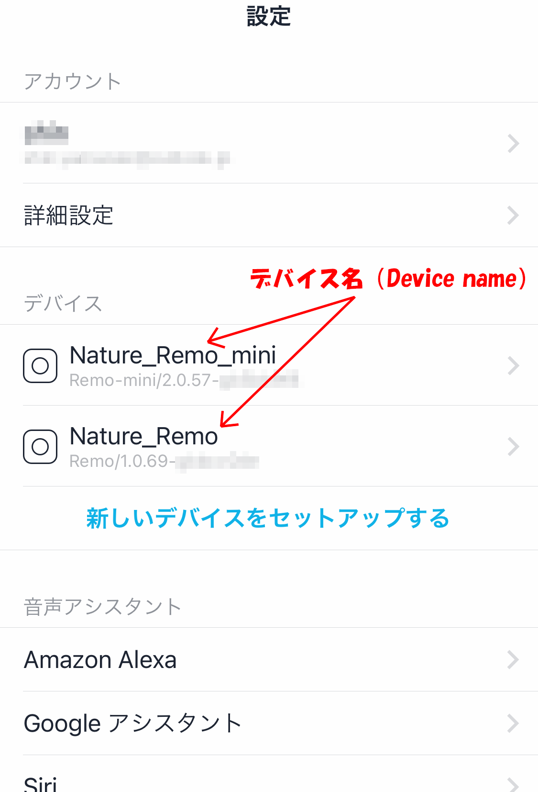

  

## 概要（Overview）

Nature Remoシリーズの温度計、湿度計、照度計、モーションセンサーで各値を測定するプログラムです。（This is a program for measuring each value with a Nature Remo series thermometer, hygrometer, Illuminance meter, and motion sensor.）

`node natureremo_cloud_sensor <access_token(1stArgument[Required]) device_name(2ndArgument[Optional])>`

  

* デバイス名については、NatureRemoが１台しか無い場合は省略可能です。
* デバイス名にSpaceが含まれる場合、指定できません。

### 特徴・要件

* `carl` が必要です。（`carl` required）
* モジュールですが単体での起動が可能です。（Although it is a module, it can be started by itself.）

### テスト環境（Testing Environment）

* Raspberry Pi 4 modelB 4GB(Raspbian GNU/Linux 10 (buster)) + Nature Remo +Nature Remo mini
* Windows10 + Nature Remo +Nature Remo mini
* MacOS BigSur (11.1) + Nature Remo +Nature Remo mini
（Untested：Nature Remo 2, Nature Remo 3, Nature Remo mini 2）

ここに書いてある事はわたしがテストした環境であり、動作を保証するものではありません。（What is written here is the environment I tested, and I do not guarantee the operation.）
もしかしたら他の環境でも動くかもしれません。

＊注意

Nature Remo Cloud APIは5分以内に30回以上のリクエストを受けるとその後ステータスコード『429』を返すようになります。

*caution

The Nature Remo Cloud API will return status code "429" after receiving 30 or more requests within 5 minutes.

## 最後に（Finally）

I can't speak English, so I use Google Translate for everything. I'm sorry if there is a rude wording.
